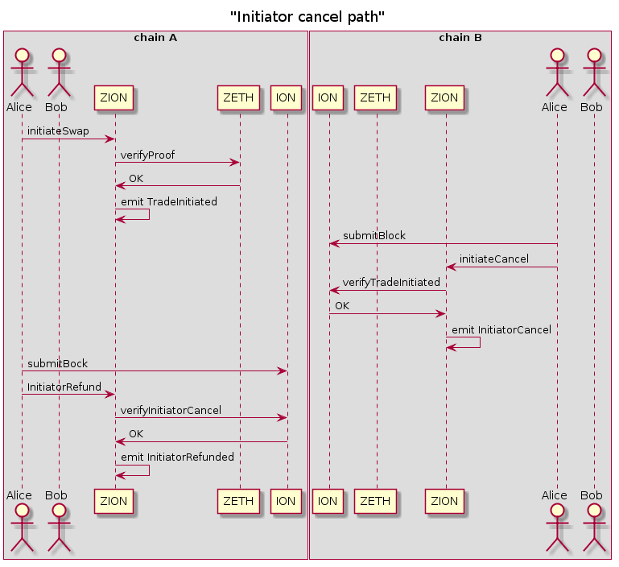

# Zion = Zeth + Ion: Private Crosschain Atomic Swaps

We combine a [private payment protocol on Ethereum](https://github.com/clearmatics/zeth) with an [interoperability protocol](https://github.com/clearmatics/ion) to create a privacy-preserving cross chain atomic swap protocol.

## Running the project

Coming soon.....

## Protocol

The Zion protocol derives a lot of the protocol procedures from its parent projects as they are heavily involved. Please see the [Zeth](https://github.com/clearmatics/zeth) and [ION](https://github.com/clearmatics/ion) projects for more details on their specific designs. Here we will discuss the Zion protocol only.

### Preconditions and Scenario

- Two chains, A and B, exist and remain online throughout the procedure
- Two participants, Alice and Bob, exist
- Both participants are present on both chains A and B
- Alice possesses Zeth notes on chain A
- Bob possesses Zeth notes on chain B
- Alice and Bob wish to exchange Alice's chain A note(s) for Bob's chain B note(s)

The goal of the Zion protocol is to allow Alice and Bob to atomically exchange their notes with each other in a trustless manner. In that the atomicity of the transaction requires no trusted party whilst upholding the privacy of the transaction.

### Procedure

1. Alice procures Zeth notes on Chain A
2. Bob procures Zeth notes on Chain B
3. Alice and Bob agree off-chain their public zeth addresses and amounts to be transacted
4. Alice decides to be the initiator in the transaction
5. Alice queries the Zeth prover to create a proof of a note creation for Bob with agreed value and recipient
6. Alice calls `initiateSwap` on Zion providing the Zeth proof on chain A, placing the Zeth note in a pending transaction pool of Zion
7. Bob witnesses the initiation on chain A and verifies the value/recipient data of the note
8. Block propagation (by Alice or Bob or a third party) occurs through Ion from chain A to B, containing the verifiable data of Alice's transaction
9. Bob queries the Zeth prover to create a proof of a note creation for Alice with agreed value and recipient
10. Bob calls `respondToSwap` on Zion on chain B providing the Zeth proof and an Ion proof of Alice's transaction on chain A, placing the Zeth note in a pending transaction pool of Zion
11. Alice witnesses the response on chain B and verifies the value/recipient data of the note
12. Block propagation occurs through Ion from chain B to A
13. Alice calls `confirmTrade` on Zion on chain A providing Ion proof of Bob's response transaction on chain B which releases Alice's pending note to Bob
14. Block propagation occurs through Ion from chain A to B
15. Alice calls `finalize` on Zion on chain B providing Ion proof of Alice's confirmation transaction on chain A which releases Bob's pending note to Alice

In this flow both participants respond timely and complete each side of the transaction. The ION proofs provide synchronisation between chains allowing synchronous logic. This prevents common vulnerabilities in atomic swaps that allow one party to exploit the other in fully asynchronous execution. Please see the attack section.

If for any reason Alice or Bob wishes to revert the swap, this can be done. This may be required in cases where:

* After Alice initiates the swap and creates a pending transaction, Bob is inactive or refuses to respond.
* After Bob responds to the swap and creates a pending transaction, Alice is inactive or refuses to confirm.

These cases may happen if Bob is offline or takes too long to respond, or if Bob views the note created by Alice and it contains incorrect values and vice versa.

#### Refund/Cancellation flows

##### Alice cancels after initiation

After Alice initiates a swap in step 6, there may be an alternative flow:

7. Alice, for whatever reason, wishes to revert the swap and cancel the pending transaction by calling `initiatorCancel` on chain B
8. Block propagation occurs through Ion from chain B to A
9. Alice calls `initiatorRefund` on Zion on chain A providing an Ion proof of Alice's cancellation on chain B, removing the pending transaction from the pool

In this flow, on chain B only one conflicting state transitions of `initiatorCancel` and `respondToSwap` is successfully applied which means either Alice is able to cancel the trade or Bob responds to the trade; they cannot both happen at the same time.

##### Cancel after response

After Bob responds to an initiated swap in step 10, there may be an alternative flow:

11. Alice or Bob, for whatever reason, wishes to revert the swap and cancel the pending transactions by calling `responderCancel` on Zion on chain A, which immediately removes the pending transaction by Alice on chain A
12. Block propagation occurs through Ion from chain A to B
13. Bob calls `responderRefund` on Zion on chain B providing an Ion proof of the cancellation on chain A, removing the pending transaction by Bob on chain B

### Sequence diagrams

### Attacks

#### Alice initiates, Bob never responds

In the situation where Bob attempts to prevent Alice from being able to spend her note by keeping the note in pending transactions without incurring the cost of having to make a commitment himself, Alice is protected by being able to cancel the trade.

#### Bob responds, Alice never confirms

In the situation where Alice attempts to prevent Bob from being able to spend his note by keeping the note in pending transactions at the cost of losing her own note, Bob is protected by being able to cancel the trade.

#### Alice/Bob commit with notes with incorrect values

In the situation where Alice and Bob commit to the cross-chain swap and Zeth notes are created with obfuscated data, Alice or Bob may create a note with incorrect obfuscated data in an attempt to cheat the other party. This could be done by creating 0 value notes or notes with a different recipient. Both parties here are protected by being able to scan the note and decrypt using their Zeth keys prior to committing.

#### Alice commits, attempts to spend same note before swap complete

In the situation where Alice creates a note for Bob for the swap but before the pending notes are released, Alice spends the same note in a double spend, Bob is protected by the confirmation step failing if the note has already been spent.

#### Bob commits, attempts to spend same note before swap complete

In the situation where Bob creates a note for Alice in response for the swap but before the pending note is released and Alice has released her note for Bob, Bob attempts to double spend his note for Alice, Alice is protected by the spend being rejected if the commitment exists in the pending transaction tree.

#### Denial of service by third parties attempting to cancel trades

### Vulnerabilities

#### Lack of sender anonymity

Due to the gas-paying nature of transactions in Ethereum, callers of the Zion/Zeth contract are in the clear as gas-paying accounts. As the Zion transaction across chains links both sides of the swap, it is trivial for an entity to link the transacting parties on both chains.
